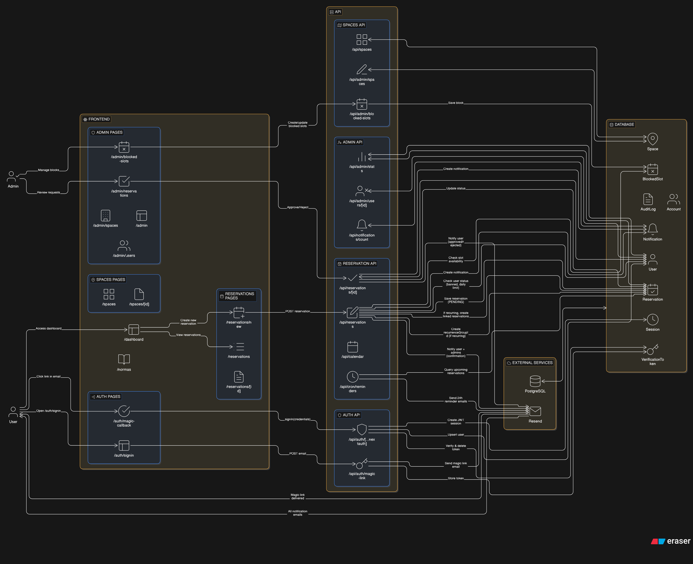
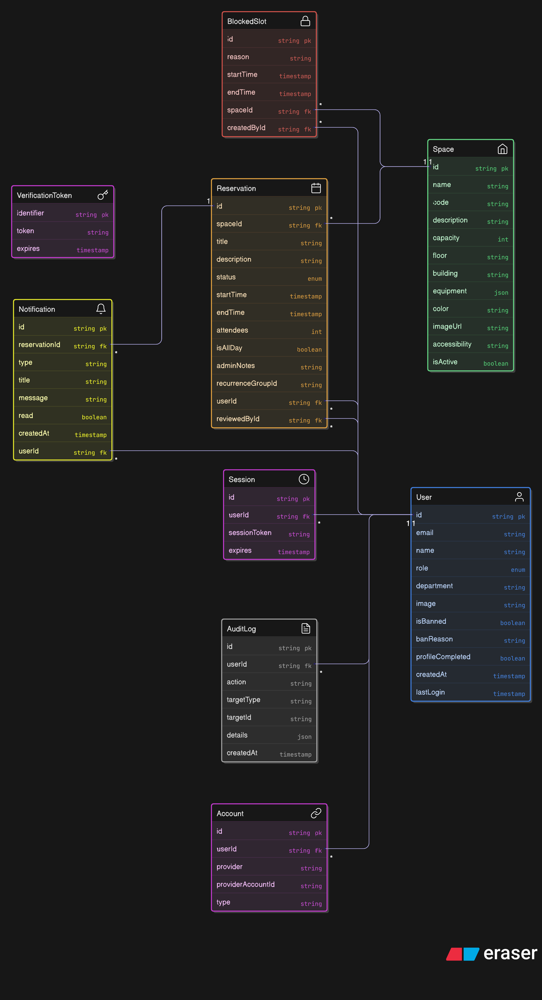
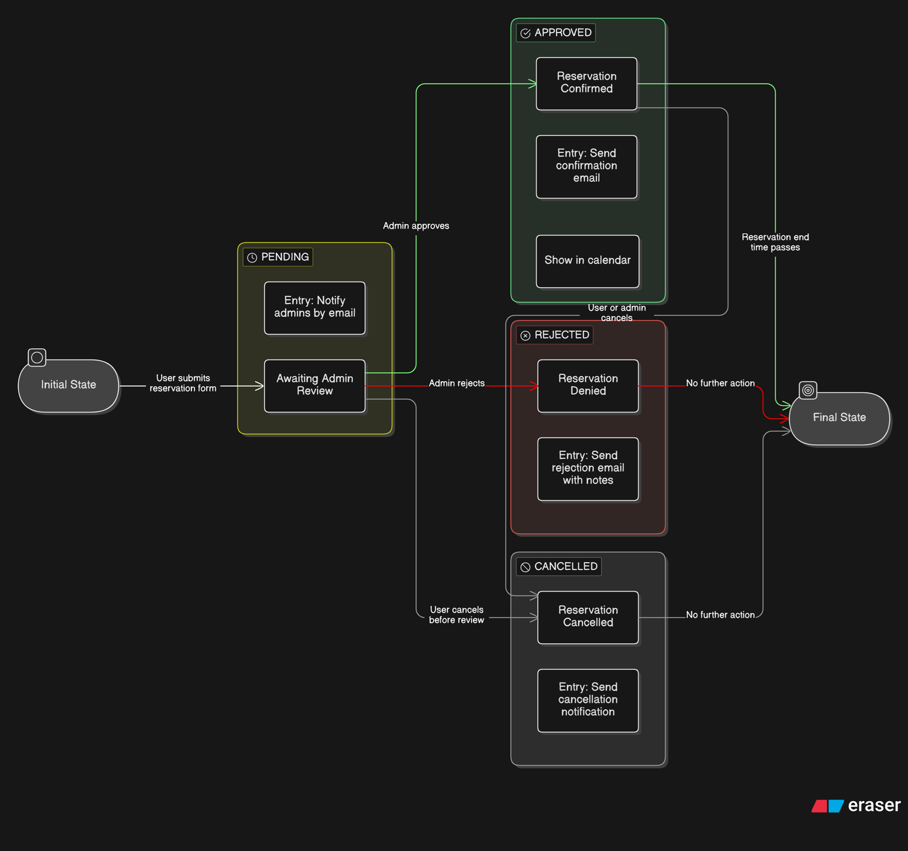
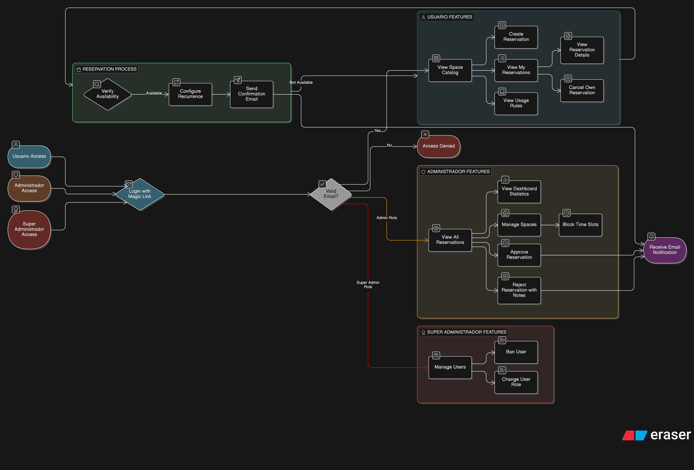
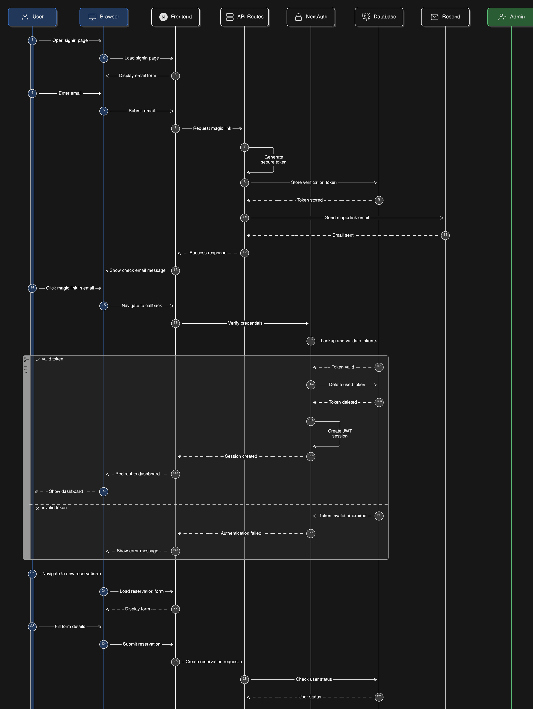
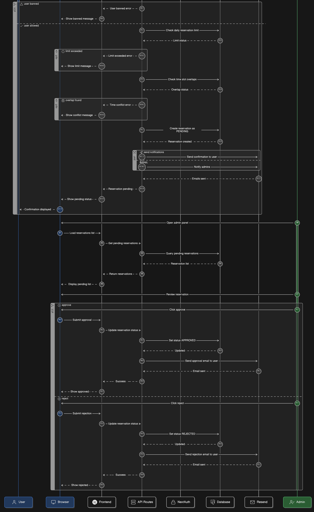

<!-- BANNER -->
<p align="center">
  
</p>

<!-- TYPING TITLE -->
<p align="center">
  <a href="https://github.com/ShockyDEV/IUCE-Reservas-TFG">
    
  </a>
</p>

<!-- BADGES -->
<p align="center">
  
  
  
  
  
  
</p>

<!-- SKILLICONS -->
<p align="center">
  <a href="https://skillicons.dev">
    
  </a>
</p>

---

## Tabla de contenidos

- [Sobre el proyecto](#sobre-el-proyecto)
- [Stack tecnológico](#stack-tecnológico)
- [Puesta en marcha](#puesta-en-marcha)
- [Scripts disponibles](#scripts-disponibles)
- [Estructura del proyecto](#estructura-del-proyecto)
- [Análisis y diseño](#análisis-y-diseño)
- [Roadmap por sprints](#roadmap-por-sprints)
- [Licencia](#licencia)
- [Autor](#autor)

---

## Sobre el proyecto

**IUCE Reservas** es un sistema web para la gestión de reservas de espacios académicos (aulas, laboratorios y salas de uso múltiple) del **Instituto Universitario de Ciencias de la Educación (IUCE)** de la Universidad de Salamanca.

El proyecto sustituye el flujo manual previo basado en correos electrónicos y hojas de cálculo por una plataforma digital con autenticación institucional, flujo de aprobación administrativa y notificaciones por correo.

Este repositorio acompaña al **Trabajo de Fin de Grado** del Grado en Ingeniería Informática de la **Universidad de Burgos** (curso 2025-26). El sistema se desarrolla aplicando metodología **Scrum** con sprints cortos y entrega continua.

> En producción: [reservas.iuce.usal.es](https://reservas.iuce.usal.es)

---

## Stack tecnológico

| Capa | Tecnología | Versión |
|------|------------|---------|
| Framework | [Next.js](https://nextjs.org) (App Router) | 14 |
| Lenguaje | TypeScript | 5 |
| ORM | [Prisma](https://www.prisma.io) | 6 |
| Base de datos | PostgreSQL | 16 |
| Autenticación | [NextAuth.js](https://next-auth.js.org) v5 (magic link) | beta |
| Email transaccional | [Resend](https://resend.com) | 4 |
| Estilos | [Tailwind CSS](https://tailwindcss.com) | 3 |
| Contenerización | Docker + docker-compose | — |
| Servidor web | Apache 2 + Let's Encrypt SSL | — |

---

## Puesta en marcha

> Requisitos: Node.js 20+, Docker y Docker Compose.

```bash
# 1. Instalar dependencias
npm install

# 2. Variables de entorno
cp .env.example .env.local

# 3. Levantar Postgres en Docker
docker-compose up -d

# 4. Aplicar el esquema y poblar la base de datos
npm run db:push
npm run db:seed

# 5. Arrancar el servidor de desarrollo
npm run dev
```

La aplicación estará disponible en [http://localhost:3000](http://localhost:3000).

<details>
<summary>Variables de entorno</summary>

| Variable | Descripción |
|----------|-------------|
| `DATABASE_URL` | Cadena de conexión a PostgreSQL. |
| `NEXTAUTH_URL` | URL pública del despliegue (ej. `http://localhost:3000`). |
| `NEXTAUTH_SECRET` | Secreto para firmar JWT (generar con `openssl rand -base64 32`). |
| `RESEND_API_KEY` | API key de Resend para enviar magic links. |
| `EMAIL_FROM` | Remitente de los correos transaccionales. |
| `NEXT_PUBLIC_USE_MOCK_AUTH` | `true` para activar mock login en desarrollo. |

</details>

<details>
<summary>Comandos avanzados</summary>

```bash
# Inspeccionar la base de datos en una UI web
npx prisma studio

# Resetear la base de datos (¡borra todos los datos!)
npx prisma migrate reset

# Compilar para producción
npm run build && npm run start
```

</details>

---

## Scripts disponibles

| Comando | Descripción |
|---------|-------------|
| `npm run dev` | Arranca Next.js en modo desarrollo. |
| `npm run build` | Genera el build de producción. |
| `npm run start` | Arranca el build de producción. |
| `npm run lint` | Ejecuta el linter. |
| `npm run db:push` | Aplica el esquema Prisma a la base de datos. |
| `npm run db:seed` | Inserta los datos iniciales (espacios). |
| `npm run db:generate` | Regenera el cliente de Prisma. |

---

## Estructura del proyecto

```
.
├── prisma/
│   ├── schema.prisma       # Modelos de datos
│   └── seed.ts             # Datos iniciales (4 espacios del IUCE)
├── public/
│   └── images/
│       ├── iuce-logo.png
│       └── spaces/         # Imágenes de cada espacio
├── src/
│   ├── app/
│   │   ├── api/
│   │   │   ├── auth/       # Magic link y NextAuth
│   │   │   └── spaces/     # API REST del catálogo
│   │   ├── auth/           # Páginas de sign-in y callback
│   │   ├── (dashboard)/
│   │   │   ├── dashboard/  # Panel del usuario
│   │   │   └── spaces/     # Catálogo público
│   │   ├── layout.tsx
│   │   └── page.tsx        # Landing
│   ├── lib/
│   │   ├── auth.ts         # Configuración NextAuth
│   │   ├── email.ts        # Envío de correos vía Resend
│   │   ├── prisma.ts       # Cliente Prisma singleton
│   │   └── space-images.ts # Mapeo de imágenes por espacio
│   └── middleware.ts       # Protección de rutas
├── docs/
│   └── img/                # Diagramas de diseño
├── docker-compose.yml      # Postgres local
└── .env.example
```

---

## Análisis y diseño

Antes de iniciar el ciclo iterativo de Scrum se elaboró toda la documentación de análisis y diseño del sistema. Estos artefactos guían la implementación incremental que se realiza sprint a sprint. Se agrupan en la épica **EPIC-00 Análisis y Diseño** del Product Backlog.

### Arquitectura del sistema

Visión general de las capas del sistema (frontend, API, base de datos y servicios externos) y sus interacciones.

<p align="center">
  
</p>

### Modelo de datos

Diagrama entidad-relación con todas las entidades del dominio y sus relaciones. Cada entidad se implementa en el sprint que cubre su área funcional.

<p align="center">
  
</p>

| Entidad | Responsabilidad | Sprint de implementación |
|---------|-----------------|--------------------------|
| `User` | Usuarios autenticados de la plataforma. | Sprint 1 |
| `Account` / `Session` / `VerificationToken` | Modelos requeridos por NextAuth. | Sprint 1 |
| `Space` | Espacios reservables del IUCE. | Sprint 2 |
| `Reservation` | Reservas de los usuarios sobre los espacios. | Sprint 3 |
| `BlockedSlot` | Bloqueos administrativos de franjas horarias. | Sprint 5 |
| `Notification` | Notificaciones internas mostradas al usuario. | Sprint 4 |
| `AuditLog` | Registro de acciones críticas. | Sprint 6 |

### Máquina de estados de una reserva

Estados por los que pasa una reserva durante su ciclo de vida y transiciones permitidas. Cada cambio de estado dispara un efecto secundario (envío de email correspondiente).

<p align="center">
  
</p>

### Flujo de procesos por rol

Funcionalidades disponibles para cada perfil de usuario (visitante, USER, ADMIN, SUPER_ADMIN) y los flujos principales que ejecutan.

<p align="center">
  
</p>

### Diagramas de secuencia

<details>
<summary>Login con magic link y creación de reserva</summary>

<p align="center">
  
</p>

</details>

<details>
<summary>Flujo de aprobación administrativa</summary>

<p align="center">
  
</p>

</details>

---

## Roadmap por sprints

El proyecto se organiza en 10 sprints (14 abril – 5 junio 2026) y 11 épicas (una previa de análisis y 10 temáticas de implementación). La gestión del Product Backlog se realiza en [Zube.io](https://zube.io) con integración bidireccional con GitHub Issues.

- [x] **Sprint 0** · Setup & Planificación *(14-20 abr)*
- [x] **Sprint 1** · Auth y Modelos base *(21-24 abr)*
- [x] **Sprint 2** · Espacios y Catálogo *(25-29 abr)*
- [x] **Sprint 3** · Calendario y Reservas v1 *(30 abr - 5 may)*
- [ ] **Sprint 4** · Aprobación y Email *(6-10 may)*
- [ ] **Sprint 5** · Recurrencia y BlockedSlot *(11-15 may)*
- [ ] **Sprint 6** · Panel Admin y Audit *(16-20 may)*
- [ ] **Sprint 7** · UX y Mobile *(21-25 may)*
- [ ] **Sprint 8** · DevOps y Despliegue *(26-30 may)*
- [ ] **Sprint 9** · QA y Release *(31 may - 5 jun)*

<details>
<summary>Ver epics</summary>

| Epic | Tema |
|------|------|
| EPIC-00 | Análisis y Diseño *(fase previa al desarrollo)* |
| EPIC-01 | Setup & Arquitectura |
| EPIC-02 | Autenticación y Usuarios |
| EPIC-03 | Gestión de Espacios |
| EPIC-04 | Motor de Reservas |
| EPIC-05 | Notificaciones por Email |
| EPIC-06 | Calendario y Visualización |
| EPIC-07 | Panel de Administración |
| EPIC-08 | UX y Diseño |
| EPIC-09 | Calidad y Testing |
| EPIC-10 | DevOps y Despliegue |

</details>

---

## Licencia

Distribuido bajo licencia **MIT**. Consulta el archivo [`LICENSE`](LICENSE) para más detalles.

Esta elección facilita la **transferencia del software** a otros institutos u organismos académicos con necesidades similares de gestión de espacios.

---

## Autor

**Enrique González Gutiérrez**<br>
Trabajo de Fin de Grado · Grado en Ingeniería Informática<br>
Universidad de Burgos · curso 2025-26

<p align="center">
  
</p>
