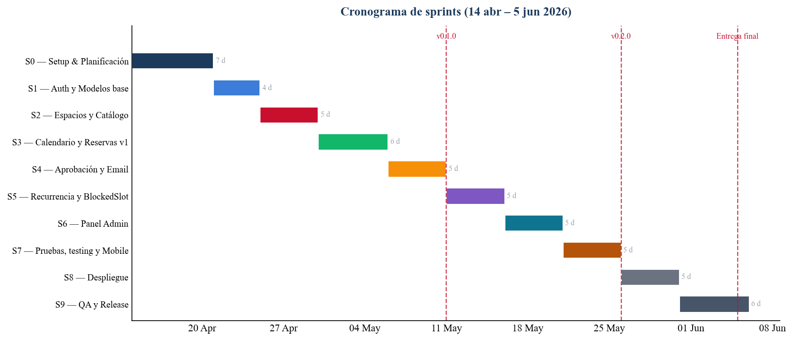
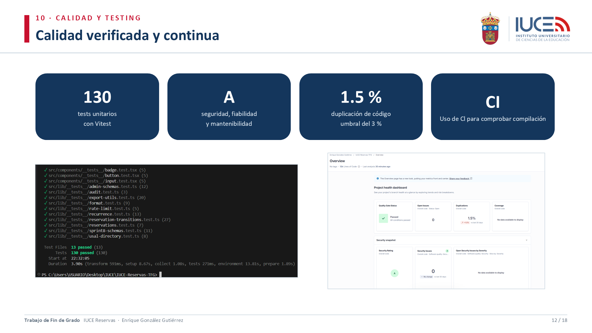
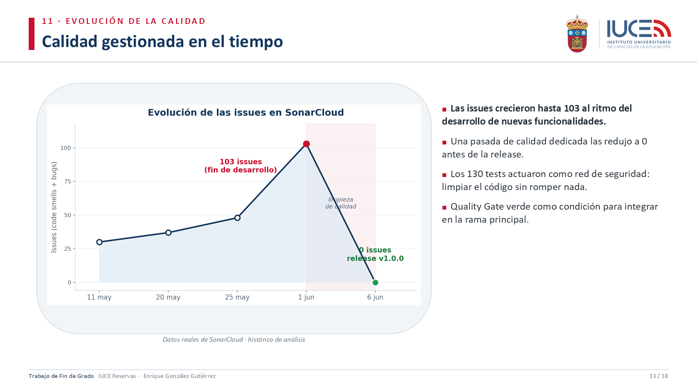

<!-- BANNER -->
<p align="center">
  
</p>

<!-- TYPING TITLE -->
<p align="center">
  <a href="https://github.com/ShockyDEV/IUCE-Reservas-TFG">
    
  </a>
</p>

<!-- BADGES -->
<p align="center">
  <a href="https://sonarcloud.io/summary/new_code?id=ShockyDEV_IUCE-Reservas-TFG">
    
  </a>
</p>

<p align="center">
  
  
  
  
  
  
  <a href="https://sonarcloud.io/summary/new_code?id=ShockyDEV_IUCE-Reservas-TFG">
    
  </a>
</p>

<!-- SKILLICONS -->
<p align="center">
  <a href="https://skillicons.dev">
    
  </a>
</p>

---

## Tabla de contenidos

- [Sobre el proyecto](#sobre-el-proyecto)
- [Stack tecnológico](#stack-tecnológico)
- [Puesta en marcha](#puesta-en-marcha)
- [Scripts disponibles](#scripts-disponibles)
- [Estructura del proyecto](#estructura-del-proyecto)
- [Documentación](#documentación)
- [Roadmap por sprints](#roadmap-por-sprints)
- [Calidad y testing](#calidad-y-testing)
- [Releases](#releases)
- [Licencia](#licencia)
- [Autor](#autor)

---

## Sobre el proyecto

El [Instituto Universitario de Ciencias de la Educación (IUCE)](https://iuce.usal.es) es un centro propio de la **Universidad de Salamanca** dedicado a la investigación, la formación y la innovación en el ámbito de las ciencias de la educación. Para soportar su actividad (grupos de investigación, programas de doctorado, seminarios y actividades abiertas a profesionales del ámbito educativo), el instituto dispone de aulas docentes, laboratorios y salas de usos múltiples que se utilizan de forma intensiva y compartida a lo largo del curso académico.

La reserva de estos espacios seguía un procedimiento manual: solicitudes por correo electrónico y comprobación de la disponibilidad en una hoja de cálculo compartida. Con el crecimiento del volumen de reservas, ese flujo se convirtió en un cuello de botella, con respuestas con días de retraso, solapamientos por errores de transcripción, ausencia de notificaciones automáticas y una sobrecarga administrativa creciente.

**IUCE Reservas** digitaliza por completo ese proceso: catálogo de espacios, formulario de solicitud con validación automática de solapamientos, panel de aprobación administrativa, notificaciones por correo en cada cambio de estado y visualización en calendario de las reservas.

Este repositorio acompaña al **Trabajo de Fin de Grado** del Grado en Ingeniería Informática de la **Universidad de Burgos** (curso 2025-26). El sistema se desarrolla aplicando metodología **Scrum** con sprints cortos y entrega continua.

> En producción: [reservas.iuce.usal.es](https://reservas.iuce.usal.es)

---

## Stack tecnológico

| Capa | Tecnología | Versión |
|------|------------|---------|
| Framework | [Next.js](https://nextjs.org) (App Router) | 14 |
| Lenguaje | TypeScript | 5 |
| ORM | [Prisma](https://www.prisma.io) | 6 |
| Base de datos | PostgreSQL | 16 |
| Autenticación | [NextAuth.js](https://next-auth.js.org) v5 (magic link) | beta |
| Email transaccional | [Resend](https://resend.com) | 4 |
| Estilos | [Tailwind CSS](https://tailwindcss.com) | 3 |
| Contenerización | Docker + docker-compose | — |
| Servidor web | Apache 2 + Let's Encrypt SSL | — |

---

## Puesta en marcha

> Requisitos: Node.js 20+, Docker y Docker Compose.

```bash
# 1. Instalar dependencias
npm install

# 2. Variables de entorno
cp .env.example .env

# 3. Levantar Postgres en Docker
docker-compose up -d

# 4. Aplicar el esquema y poblar la base de datos
npm run db:push
npm run db:seed

# 5. Arrancar el servidor de desarrollo
npm run dev
```

La aplicación estará disponible en [http://localhost:3000](http://localhost:3000).

<details>
<summary>Variables de entorno</summary>

| Variable | Descripción |
|----------|-------------|
| `DATABASE_URL` | Cadena de conexión a PostgreSQL. |
| `NEXTAUTH_URL` | URL pública del despliegue (ej. `http://localhost:3000`). |
| `NEXTAUTH_SECRET` | Secreto para firmar JWT (generar con `openssl rand -base64 32`). |
| `RESEND_API_KEY` | API key de Resend para enviar magic links. |
| `EMAIL_FROM` | Remitente de los correos transaccionales. |
| `NEXT_PUBLIC_USE_MOCK_AUTH` | `true` para activar mock login en desarrollo. |

</details>

<details>
<summary>Comandos avanzados</summary>

```bash
# Inspeccionar la base de datos en una UI web
npx prisma studio

# Resetear la base de datos (¡borra todos los datos!)
npx prisma migrate reset

# Compilar para producción
npm run build && npm run start
```

</details>

---

## Scripts disponibles

| Comando | Descripción |
|---------|-------------|
| `npm run dev` | Arranca Next.js en modo desarrollo. |
| `npm run build` | Genera el build de producción. |
| `npm run start` | Arranca el build de producción. |
| `npm run lint` | Ejecuta el linter. |
| `npm run test` | Ejecuta la suite de tests con Vitest. |
| `npm run db:push` | Aplica el esquema Prisma a la base de datos. |
| `npm run db:seed` | Inserta los datos iniciales (espacios). |
| `npm run db:generate` | Regenera el cliente de Prisma. |

---

## Estructura del proyecto

```
.
├── prisma/
│   ├── schema.prisma       # 9 modelos de datos
│   └── seed.ts             # Datos iniciales (4 espacios del IUCE)
├── public/
│   └── images/
│       ├── iuce-logo.png
│       └── spaces/         # Imágenes de cada espacio
├── src/
│   ├── app/
│   │   ├── api/            # 26 endpoints REST (route handlers)
│   │   │   ├── auth/          # Magic link y NextAuth
│   │   │   ├── spaces/        # Catálogo, disponibilidad y ocupación
│   │   │   ├── reservations/  # Motor de reservas
│   │   │   ├── notifications/ # Notificaciones in-app
│   │   │   ├── users/         # Perfil del usuario
│   │   │   ├── admin/         # Gestión, informes y exportaciones
│   │   │   ├── cron/          # Tareas programadas (recordatorios)
│   │   │   └── health/        # Health check
│   │   ├── auth/           # Páginas de acceso y callback
│   │   ├── (dashboard)/    # Panel de usuario y catálogo público
│   │   ├── (admin)/        # Panel de administración
│   │   ├── layout.tsx
│   │   └── page.tsx        # Landing
│   ├── components/         # Componentes de UI (CVA + Tailwind)
│   ├── lib/
│   │   ├── auth.ts            # Configuración de NextAuth
│   │   ├── email.ts          # Envío de correos vía Resend
│   │   ├── prisma.ts         # Cliente Prisma singleton
│   │   ├── reservations.ts   # Lógica y transiciones de estado de reservas
│   │   ├── usal-directory.ts # Consulta de nombres al directorio USAL
│   │   ├── rate-limit.ts     # Limitación de peticiones
│   │   └── validations.ts    # Esquemas de validación (Zod)
│   └── middleware.ts       # Middleware de Next.js
├── docs/
│   ├── manuales/           # Memoria y anexos del TFG en PDF
│   └── img/                # Capturas e imágenes de las releases
├── docker-compose.yml      # PostgreSQL en local
└── .env.example
```

---

## Documentación

La documentación completa del proyecto se publica en PDF en la carpeta [`docs/manuales/`](docs/manuales/). La memoria es el documento principal del TFG y los anexos recogen, en seis apéndices, el plan de proyecto, la especificación de requisitos, el diseño del sistema, la documentación técnica, los manuales de usuario y de administrador y el anexo de sostenibilización curricular.

| Documento | Contenido |
|-----------|-----------|
| [Memoria](docs/manuales/Memoria.pdf) | Objetivos, conceptos teóricos, metodología, aspectos relevantes del desarrollo y conclusiones. |
| [Anexos (documento completo)](docs/manuales/Anexos.pdf) | Los seis apéndices reunidos en un único PDF. |
| [Apéndice A. Plan de Proyecto Software](docs/manuales/Anexo_A_Plan_de_Proyecto.pdf) | Alcance, planificación por sprints, estudio de viabilidad económica y legal, y gestión de riesgos. |
| [Apéndice B. Especificación de Requisitos](docs/manuales/Anexo_B_Especificacion_de_Requisitos.pdf) | Requisitos funcionales y no funcionales, casos de uso y trazabilidad. |
| [Apéndice C. Especificación de Diseño](docs/manuales/Anexo_C_Especificacion_de_Diseno.pdf) | Arquitectura, modelo de datos, máquina de estados, diagramas de secuencia y despliegue. |
| [Apéndice D. Documentación Técnica de Programación](docs/manuales/Anexo_D_Documentacion_Tecnica.pdf) | Manual del programador: estructura del proyecto, API REST, sistema de email y pruebas. |
| [Apéndice E. Documentación de Usuario](docs/manuales/Anexo_E_Documentacion_de_Usuario.pdf) | Instalación en local, guía del usuario y guía del administrador. |
| [Apéndice F. Sostenibilización Curricular](docs/manuales/Anexo_F_Sostenibilizacion_Curricular.pdf) | Contribución del proyecto a los Objetivos de Desarrollo Sostenible. |

---

## Roadmap por sprints

El proyecto se organiza en 10 sprints (14 abril – 5 junio 2026) y 12 épicas (una previa de análisis, diez de implementación y una de releases y distribución). La gestión del Product Backlog se realiza en [Zube.io](https://zube.io) con integración bidireccional con GitHub Issues.

<p align="center">
  
</p>

- [x] **Sprint 0** · Setup & Planificación *(14-20 abr)*
- [x] **Sprint 1** · Auth y Modelos base *(21-24 abr)*
- [x] **Sprint 2** · Espacios y Catálogo *(25-29 abr)*
- [x] **Sprint 3** · Calendario y Reservas v1 *(30 abr - 5 may)*
- [x] **Sprint 4** · Aprobación y Email *(6-10 may)*
- [x] **Sprint 5** · Recurrencia y BlockedSlot *(11-15 may)*
- [x] **Sprint 6** · Panel Admin y Audit *(16-20 may)*
- [x] **Sprint 7** · UX y Mobile *(21-25 may)*
- [x] **Sprint 8** · Funcionalidades finales y Despliegue *(26-30 may)*
- [x] **Sprint 9** · QA y Release *(31 may - 5 jun)*

<details>
<summary>Ver epics</summary>

| Epic | Tema |
|------|------|
| EPIC-00 | Análisis y Diseño *(fase previa al desarrollo)* |
| EPIC-01 | Setup & Arquitectura |
| EPIC-02 | Autenticación y Usuarios |
| EPIC-03 | Gestión de Espacios |
| EPIC-04 | Motor de Reservas |
| EPIC-05 | Notificaciones por Email |
| EPIC-06 | Calendario y Visualización |
| EPIC-07 | Panel de Administración |
| EPIC-08 | UX y Diseño |
| EPIC-09 | Calidad y Testing |
| EPIC-10 | Despliegue |
| EPIC-11 | Releases y Distribución |

</details>

---

## Calidad y testing

La calidad del código se verifica de forma continua: 130 tests unitarios con Vitest, análisis estático en SonarCloud con calificación A en seguridad, fiabilidad y mantenibilidad, y un pipeline de integración continua en GitHub Actions que ejecuta el linter, la comprobación de tipos y la suite completa de pruebas en cada cambio, además del build de producción en la rama principal.

<p align="center">
  
</p>

Las issues señaladas por SonarCloud crecieron al ritmo del desarrollo hasta las 103 y una pasada de calidad previa a la release final las redujo a cero, con la suite de tests como red de seguridad durante la limpieza.

<p align="center">
  
</p>

> Proyecto en SonarCloud: [sonarcloud.io/project/overview?id=ShockyDEV_IUCE-Reservas-TFG](https://sonarcloud.io/project/overview?id=ShockyDEV_IUCE-Reservas-TFG)

---

## Releases

Cada cierre de hito relevante del proyecto se publica como una **release** versionada en GitHub. Ahí se incluye el changelog detallado, capturas de la interfaz, evidencias de calidad (tests + SonarCloud) e instrucciones para levantar la versión correspondiente en local.

> Página completa con todas las publicaciones: [github.com/ShockyDEV/IUCE-Reservas-TFG/releases](https://github.com/ShockyDEV/IUCE-Reservas-TFG/releases)

| Versión | Estado | Fecha | Contenido principal |
|---------|--------|-------|---------------------|
| [`v1.0.0`](https://github.com/ShockyDEV/IUCE-Reservas-TFG/releases/tag/v1.0.0) | Stable | 5 junio 2026 | **Release final**. Cierre de Sprints 8-9: notificaciones in-app, cancelación de reservas, EXPIRED + cron, perfil editable, normas, ban de usuarios, sincronización de nombres con el directorio USAL, exportación CSV, filtros de catálogo, Mis Reservas, informes de administración y CRUD de espacios. Pipeline CI con GitHub Actions, health check, rate limit y guía de despliegue en CPD-USAL. **130 tests** verdes. |
| [`v0.2.0`](https://github.com/ShockyDEV/IUCE-Reservas-TFG/releases/tag/v0.2.0) | Pre-release | 26 mayo 2026 | Cierre de Sprints 5-7: bloqueos administrativos, reservas recurrentes, panel admin completo con audit log, refinado UX y mobile, suite de tests con Vitest y SonarCloud Quality Gate **Passed**. |
| [`v0.1.0`](https://github.com/ShockyDEV/IUCE-Reservas-TFG/releases/tag/v0.1.0) | Pre-release | 11 mayo 2026 | Cierre de Sprints 1-4: autenticación con magic link, catálogo de espacios, motor de reservas y flujo de aprobación administrativa con notificaciones por email. |

---

## Licencia

Distribuido bajo licencia **MIT**. Consulta el archivo [`LICENSE`](LICENSE) para más detalles.

Todas las dependencias del proyecto se distribuyen bajo licencias permisivas (MIT, ISC y Apache 2.0), compatibles con la licencia del proyecto. El análisis de licencias completo se recoge en el estudio de viabilidad legal de los anexos del Trabajo de Fin de Grado.

Esta elección facilita la **transferencia del software** a otros institutos u organismos académicos con necesidades similares de gestión de espacios.

---

## Autor

**Enrique González Gutiérrez**<br>
Trabajo de Fin de Grado · Grado en Ingeniería Informática<br>
Universidad de Burgos · curso 2025-26

<p align="center">
  
</p>
